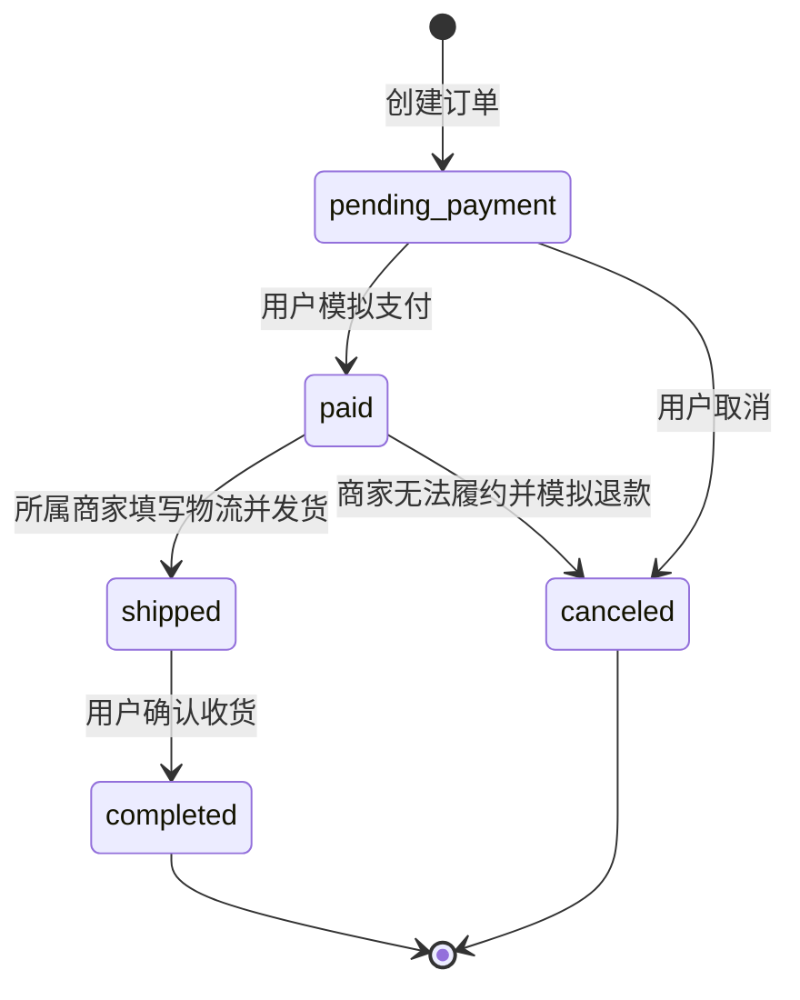
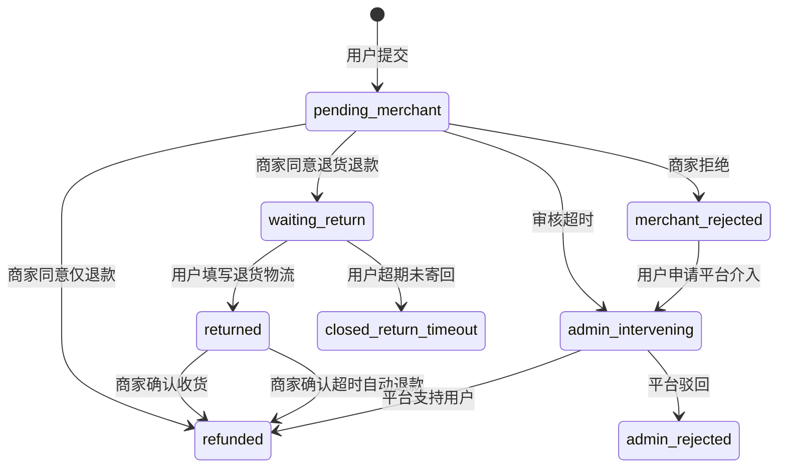

# 业务规则、状态机与权限矩阵

## 1. 设计原则

- **领域服务统一校验**：页面和小程序都调用同一套订单/售后服务，不能各写一份规则。
- **状态驱动操作**：按钮是否出现只是用户体验，真正安全性由后端再次校验。
- **最小权限**：商家只能操作本店数据；客服、业务、技术管理员拥有不同能力。
- **超时兜底**：没有回应也是一种业务状态，系统必须为用户提供下一步。
- **可审计**：每次核心状态变化记录操作者、角色、对象、前后状态和原因。

## 2. 跨商家拆单

一辆购物车可以包含多个商家的商品，但结算时按 `merchant_id` 分组生成多张订单。理由：

1. 不同商家发货时间、物流单号和退款责任不同；
2. 一个商家缺货或退款不应阻塞其他商家；
3. 平台可按商家结算和考核履约；
4. 售后责任对象清晰，不需要拆分订单项后再次确认责任。

## 3. 订单状态机

不允许：未支付直接发货、已取消再次支付、其他商家发货、商家替用户确认收货。

## 4. 售后状态机

## 5. 关键时间规则

| 环节 | 默认期限 | 超时处理 |
|---|---:|---|
| 商家审核售后 | 48 小时 | 自动升级平台介入 |
| 用户寄回商品 | 7 天 | 售后关闭，可保留再次申诉入口作为后续扩展 |
| 商家确认退货收货 | 72 小时 | 系统自动退款 |
| 用户催办商家 | 每 6 小时最多一次 | 防止频繁骚扰和重复通知 |

## 6. 权限矩阵

| 功能 | 用户 | 商家 | 客服管理员 | 业务管理员 | 技术管理员 | 超级管理员 |
|---|:---:|:---:|:---:|:---:|:---:|:---:|
| 浏览商品/购物车/下单 | ✓ | - | - | - | - | ✓ |
| 查看本人订单/售后 | ✓ | - | - | - | - | ✓ |
| 管理本店商品 | - | ✓ | - | - | - | ✓ |
| 本店发货/售后审核 | - | ✓ | - | - | - | ✓ |
| 平台售后仲裁 | - | - | ✓ | ✓ | - | ✓ |
| 停用账号 | - | - | - | ✓ | - | ✓ |
| 全平台商品治理 | - | - | - | ✓ | - | ✓ |
| 查看审计日志 | - | - | - | ✓ | ✓ | ✓ |
| 修改系统技术配置 | - | - | - | - | 后续扩展 | ✓ |

## 7. 数据一致性风险与当前处理

- 下单前重新验证商品是否上架和库存是否充足；创建订单时扣减库存。
- 取消未完成订单时恢复库存。
- 同一订单不允许同时存在多个进行中的售后。
- 所有变更在单个数据库事务中提交，失败则不提交。
- 课程版 SQLite 适合单机演示；高并发生产版应使用 PostgreSQL/MySQL、行级锁、幂等键和消息队列。
